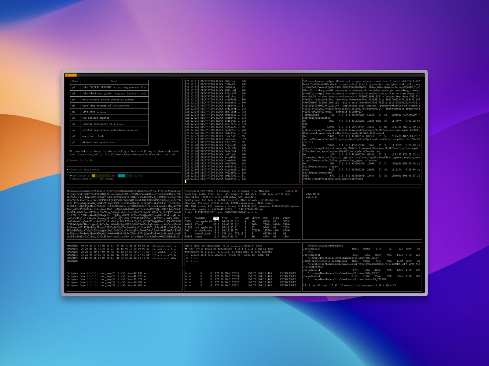

# claudefiles



Portable Claude Code configuration. Like dotfiles, but for Claude.

At the moment, this repo is **opinionated toward Claude Code**. It does not support other AI coding assistants.

## About

Developers have been versioning their [dotfiles](https://github.com/thoughtbot/dotfiles) for decades. A `.bashrc`, `.vimrc`, `.gitconfig`. These tiny files define how your tools behave. Clone them onto a new machine and it feels like your personal computer.

Claudefiles applies the same idea to Claude Code. Skills, commands, hooks, sounds, and settings, versioned in a repo, deployed to `~/.claude/` on any machine. Your AI assistant, configured exactly how you want it, everywhere.

## Why this exists

I use Claude primarily for two things: managing my personal knowledge system (Obsidian) and writing software in Node.js, Rust and Golang. This repo is a minimal, portable setup that helps me bootstrap new systems. VMs, servers, side projects, multi-agent architectures where Claude runs not just on my personal machine but across environments. Clone, run Claude, done.

The design assumes Claude is smart enough to read a YAML manifest and configure itself. No complex bash installers. The `/setup` command reads `claudefiles.yaml` and does the right thing. Copies files, merges settings, resolves platform differences. This is a shift from imperative scripting into Agentic setup.

## Installing

### Requirements

- [Claude Code](https://docs.anthropic.com/en/docs/claude-code) (CLI)
- `git`
- `jq` — hooks parse tool input JSON
- macOS or Linux
- `gh` (optional) — only needed for `preview-markdown.sh`

### Quick install

```bash
curl -fsSL https://raw.githubusercontent.com/koolamusic/claudefiles/main/bootstrap.sh | bash
```

This clones the repo to `~/.claudefiles`. Then run Claude to deploy:

```bash
cd ~/.claudefiles && claude "/setup"
```

### Manual install

```bash
git clone git@github.com:koolamusic/claudefiles.git ~/.claudefiles
cd ~/.claudefiles && claude "/setup"
```

### What `/setup` does

`/setup` is a project-level command (`.claude/commands/setup.md`). It only works when Claude is running inside the claudefiles repo, which is why the install steps above `cd` into it first.

The command reads `claudefiles.yaml` (the manifest) and:

1. Detects your platform (macOS or Linux)
2. Copies skills, commands, hooks, and sounds to `~/.claude/`
3. Smart-merges settings into `~/.claude/settings.json` (backs up existing settings first)
4. Resolves platform-specific template variables (e.g., `afplay` vs `aplay` for sound)
5. Asks which experimental features to enable — off unless you say yes, and a feature whose prerequisite tool is not on your PATH is skipped with a pointer to its install

## What's included

### Skills

| Skill | Description | Source |
|-------|-------------|--------|
| agent-browser | Browser automation with Playwright | [vercel-labs/agent-browser](https://github.com/vercel-labs/agent-browser) |
| breadboarding | UI breadboarding (Shape Up) | [rjs/shaping-skills](https://github.com/rjs/shaping-skills) |
| docx | Word document creation and editing | [anthropics/skills](https://github.com/anthropics/skills) |
| explainer-formats | Explain a topic as Simplified Technical English prose, a diagram, an HTML page, or a video; `/explain` with a strictness dial | original |
| golang-best-practices | Go concurrency, microservices, gRPC, generics | [Jeffallan/claude-skills](https://github.com/Jeffallan/claude-skills) |
| nestjs-best-practices | NestJS architecture and patterns | [Kadajett/agent-nestjs-skills](https://github.com/Kadajett/agent-nestjs-skills) |
| pdf | PDF processing and manipulation | [anthropics/skills](https://github.com/anthropics/skills) |
| pptx | PowerPoint creation | [anthropics/skills](https://github.com/anthropics/skills) |
| react-best-practices | React/Next.js performance patterns | [vercel-labs/agent-skills](https://github.com/vercel-labs/agent-skills) |
| rust-best-practices | Idiomatic Rust, ownership, error handling, testing | [apollographql/skills](https://github.com/apollographql/skills) |
| skill-creator | Create and test new skills (TDD methodology) | [anthropics/skills](https://github.com/anthropics/skills) + [obra/superpowers](https://github.com/obra/superpowers) |
| wildcard-proxy | Caddy setup that routes `https://<port>.<domain>/` and two-letter or named labels to loopback ports, with gated on-demand TLS | original |
| xlsx | Excel spreadsheet processing | [anthropics/skills](https://github.com/anthropics/skills) |

### Commands

| Shorthand | What it does | Scope |
|---------|-------------|-------|
| `/setup` | Install claudefiles to `~/.claude/` | Project-level (runs inside this repo only) |
| `/gitcommit` | Git commit with conventional commit format and message-quality spec | Global (deployed to `~/.claude/commands/`) |
| `/gitconfig` | Configure git — SSH keys, aliases, templates, hooks (local or global) | Global (deployed to `~/.claude/commands/`) |

### Hooks

| Hook | Trigger | What it does |
|------|---------|-------------|
| context-monitor | PostToolUse | Warns when context usage runs high, and suggests checkpointing the sprint before you lose the thread. |
| retro-reminder | SessionStart | Flags a retrospective left pending from an earlier session. |
| retro-trigger | PostToolUse (Write\|Edit\|Bash) | Spots a phase finishing and starts a retrospective, depending on the configured mode. |
| trust-monitor | SessionStart, PreToolUse, PostToolUse | Runs a per-session trust ladder that gates tools by level. Opt-in. |
| statusline-wrapper | statusLine | Appends the trust bar to whatever statusline you already have. |

### Plugins

Installed by Claude Code from the `claudefiles` marketplace on the first startup after `/setup`.

| Plugin | What it does |
|--------|-------------|
| feature-dev | Guided feature development (official Claude plugins marketplace) |
| ux | Frontend design and review commands |
| jira | Sprint workflow — research, plan, execute, review. The primary workflow; see `plugins/jira/README.md`. |
| warden | Acceptance-test playbook; see `plugins/warden/README.md` |
| studio | Per-project workflow workspace — keeps `.project/`, `.jira/`, `.uat/` state as symlinks into a private `~/.studio/` git repo. Clone or create `~/.studio/` before running `/studio:setup`; see `plugins/studio/README.md`. |

### Experimental features

Opt-in during `/setup`; declared under `experimental.features` in `claudefiles.yaml`.

| Feature | What it does | Prerequisites |
|---------|-------------|---------------|
| trust-monitor | Per-session trust ladder that gates tools by level and adds a trust bar to the statusline. `/trust` awards and deducts. | `jq` |
| tower | Runs the `orchestrator` skill's war room on visible [Herdr](https://herdr.dev) panes so you can watch every child agent work. `tower on`, `tower off`, `tower status`. Installs the `tower` skill only when enabled. | `herdr` on PATH and a session inside a Herdr-managed pane; the `orchestrator` skill (installed by default) |
| raydr | Hear your sessions: [raydr](https://www.npmjs.com/package/@tensorkit/raydr) speaks replies, permission prompts, and notifications on your phone. Nothing is copied from this repo; opting in runs `raydr hooks install`, which writes the `/raydr` command and its hooks into `~/.claude/` and keeps them current with the CLI. Quickstart: `npm i -g @tensorkit/raydr`, then `raydr init`.<br>Using the CLI: `raydr init` picks providers, writes `~/.config/raydr/env`, and generates the access key (`--force` re-picks and keeps keys); `raydr start` runs the server; `raydr doctor` checks node, the env file, providers, hooks, and the server; `/raydr` in a session opts it in. Full command table on the [npm page](https://www.npmjs.com/package/@tensorkit/raydr). | `raydr` on PATH (`npm i -g @tensorkit/raydr`, Node 24 or newer) |

### Sounds

SCV-themed audio cues (StarCraft). Claude plays a voice line on startup, when you submit a prompt, and when a task finishes.

| Event | Sound |
|-------|-------|
| Session start | "SCV good to go, sir!" |
| Prompt submit | Random acknowledgment (7 variants) |
| Task complete | Random completion (3 variants) |

### Neovim integration

Claude Code integration for Neovim via [coder/claudecode.nvim](https://github.com/coder/claudecode.nvim). Deployed to `~/.config/nvim/lua/plugins/`. Provides `<leader>a` keybindings for toggling Claude, sending selections, managing diffs, and more. Requires [lazy.nvim](https://github.com/folke/lazy.nvim) and [folke/snacks.nvim](https://github.com/folke/snacks.nvim).

### Git templates

Opinionated git configuration in `dotfiles/`, installed separately via `/gitconfig` (these go to `~/.gitconfig`, not `~/.claude/`). Inspired by [thoughtbot/dotfiles](https://github.com/thoughtbot/dotfiles).

- **gitconfig** — `push.default = current`, `merge.ff = only`, `fetch.prune = true`, useful aliases, commit template, colorMoved
- **gitignore** — global ignores for `.DS_Store`, `.env`, `node_modules`, swap files, build artifacts
- **gitmessage** — commit template prompting for why, how, and side effects
- **tmux.conf** — tmux configuration
- **templates/hooks/** — ctags regeneration on commit/merge/checkout/rewrite, local hook delegation

## Configuration

`claudefiles.yaml` is the source of truth. It declares:

- **install.targets** — what directories to copy and where
- **settings** — hooks, plugins, and preferences to merge into `settings.json`
- **platform** — OS-specific values (sound player binary)

```
claudefiles/
├── bootstrap.sh              # Clone + print setup instructions
├── claudefiles.yaml          # Manifest (source of truth)
├── settings.json             # Reference settings (final structure)
├── CLAUDE.md                 # Repo architecture for Claude
├── .claude/commands/          # Project-level commands (setup)
├── commands/                 # Global slash commands (.md)
│   ├── gitcommit.md
│   └── gitconfig.md
├── dotfiles/                 # Git config, ignore, message template, hooks, nvim
│   ├── gitconfig
│   ├── gitignore
│   ├── gitmessage
│   ├── tmux.conf
│   ├── nvim/plugins/         # Neovim plugin configs (lazy.nvim specs)
│   │   └── claudecode.lua    # coder/claudecode.nvim
│   └── templates/hooks/
├── hooks/                    # Claude Code hook scripts
├── sounds/                   # SCV audio files (.wav)
└── skills/                   # Skill directories
    ├── agent-browser/
    ├── breadboarding/
    │   ├── SKILL.md
    │   ├── references/       # Progressive-disclosure docs (8 files)
    │   └── scripts/          # preview-markdown.sh
    ├── ...
    ├── tower/                # Opt-in: copied only when the tower feature is enabled
    └── xlsx/
```

## Extending

### Add a skill

1. Create a directory under `skills/` with a `SKILL.md` file
2. Include YAML frontmatter: `name` and `description`
3. Use `/skill-creator` for guidance on structure and testing
4. Run `/setup` from inside the claudefiles repo to deploy

### Add a command

1. Create a `.md` file under `commands/` with YAML frontmatter (`name`, `allowed-tools`, `description`)
2. Run `/setup` from inside the claudefiles repo to deploy

### Add a hook

1. Create an executable script in `hooks/`
2. Include a YAML-style documentation header in comments
3. Add the corresponding trigger to `claudefiles.yaml` under `settings.hooks`
4. Run `/setup` from inside the claudefiles repo to deploy

### Add an experimental feature

1. Add an entry under `experimental.features` in `claudefiles.yaml` with a `name` and `description`
2. Declare what opting in does: a `settings:` fragment to merge, `enablePlugin:` for a plugin, `skills:` for a skill copied only on opt-in, or `run:` for commands an external tool's own installer provides (the catalogue then points at the tool instead of carrying a copy of its files)
3. List external prerequisites under `requires:` so `/setup` skips the feature, with an install pointer, when the command is not on PATH
4. Add a row to the experimental features table above

## Other skills worth checking out

Skills that didn't make the bootstrap cut — too project-specific, experimental, or better added per-project:

| Skill | Source | Description |
|-------|--------|-------------|
| systematic-debugging | [obra/superpowers](https://github.com/obra/superpowers) | Root cause tracing, defense-in-depth debugging |
| subagent-driven-development | [obra/superpowers](https://github.com/obra/superpowers) | Dispatch parallel subagents for implementation tasks |
| writing-plans | [obra/superpowers](https://github.com/obra/superpowers) | Structured planning with execution handoff |
| canvas-design | [anthropics/skills](https://github.com/anthropics/skills) | Design with HTML5 Canvas |
| brand-guidelines | [anthropics/skills](https://github.com/anthropics/skills) | Maintain brand consistency in outputs |
| marketing-skills | [coreyhaines31/marketingskills](https://github.com/coreyhaines31/marketingskills) | Marketing strategy and content creation |
| webapp-testing | [anthropics/skills](https://github.com/anthropics/skills) | Web app testing with Playwright |

## Contributing

This is a personal configuration repo shared publicly. It's not a community project — I decide what goes in.

**Issues first, always.** Every contribution starts with an issue. PRs without an approved issue will be closed — no exceptions.

1. **Open an issue** — describe the bug, suggestion, or correction
2. **Wait for approval** — I'll respond with whether it fits
3. **If approved**, I'll implement it or invite you to submit a PR

### Good issues

- Bug reports: setup command fails, broken references, missing files
- Suggestions: a skill that belongs in the bootstrap set, a useful hook, a missing convention
- Corrections: wrong attribution, broken links, outdated information

### Will get closed

- Any PR without an approved issue
- PRs that add skills I don't use
- PRs that change the repo's opinions (e.g., adding support for non-Claude assistants)
- PRs that restructure things for aesthetic reasons

### Want to extend this?

Fork it. That's the whole point of dotfiles — they're personal. Clone, rip out what you don't need, add what you do, make it yours. The structure is simple enough to understand in 10 minutes.

See [CONTRIBUTING.md](./CONTRIBUTING.md) for the full policy (including notes for AI agents).

## Interesting tooling we're watching

Tools and skills we don't use in claudefiles but are worth knowing about:

| Tool | What it is | Why it's interesting | Link |
|------|-----------|---------------------|------|
| Fabro | Open-source workflow orchestration for AI agents. Define pipelines as Graphviz DOT graphs with multi-model routing, human gates, and cloud sandboxes. Single Rust binary. | Deterministic walk-away execution — define a graph, close your laptop, come back to results. CSS-like model stylesheets route cheap tasks to fast models and hard tasks to frontier models. Competes with GSD but from the opposite direction: GSD enhances interactive sessions, Fabro replaces them with unattended graphs. | [fabro.sh](https://docs.fabro.sh) / [GitHub](https://github.com/fabro-sh/fabro) |
| userinterface.wiki | 152 UI design rules packaged as a Claude Code skill. | Comprehensive design knowledge distilled into a single skill file. Good complement to frontend work if you want design guardrails baked into agent output. | [userinterface.wiki/skill](https://www.userinterface.wiki/skill) |

## Future work

**Claudefiles spec** — a formal specification for the `claudefiles.yaml` manifest format. Schema, validation, versioning, cross-repo compatibility. This would let anyone create interoperable claudefiles repos. Not tackling yet.

## License

[MIT](./LICENSE)

## Acknowledgments

Most skills here weren't written by me. This repo curates and organizes work from:

- [Anthropic](https://github.com/anthropics/skills) — official skills (pdf, docx, xlsx, pptx, skill-creator)
- [obra/superpowers](https://github.com/obra/superpowers) — writing-skills, TDD methodology
- [vercel-labs](https://github.com/vercel-labs) — agent-browser, react-best-practices
- [rjs/shaping-skills](https://github.com/rjs/shaping-skills) — Shape Up breadboarding
- [Kadajett/agent-nestjs-skills](https://github.com/Kadajett/agent-nestjs-skills) — NestJS best practices
- [thoughtbot/dotfiles](https://github.com/thoughtbot/dotfiles) — git config, templates, and hooks
- [Jeffallan/claude-skills](https://github.com/Jeffallan/claude-skills) — golang-best-practices
- [apollographql/skills](https://github.com/apollographql/skills) — rust-best-practices
- [htjun/claude-code-hooks-scv-sounds](https://github.com/htjun/claude-code-hooks-scv-sounds) — SCV sound files
- [coder/claudecode.nvim](https://github.com/coder/claudecode.nvim) — Neovim integration for Claude Code
- [JuliusBrussee/caveman](https://github.com/JuliusBrussee/caveman) — inspiration for the default tight tone in `dotfiles/CLAUDE.md` (lite mode adapted as a global directive)
