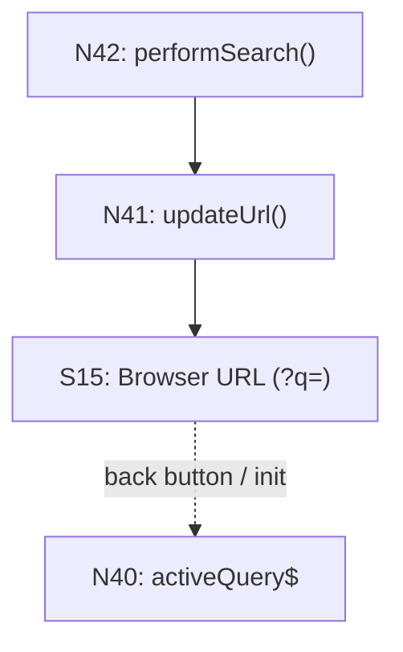

# Breadboarding: Key Principles

## Never use memory — always check the data

When tracing a flow backwards, don't follow the path you remember. Scan the Wires Out column for ALL affordances that wire to your target.

When filling in the tables, read each row systematically. Don't rely on what you think you know.

The tables are the source of truth. Your memory is unreliable.

## Every affordance name must exist (when mapping)

When mapping existing code, never invent abstractions. Every name must point to something real in the codebase.

## Mechanisms aren't affordances

An affordance is something you can **act upon** that has meaningful identity in the system. Several things look like affordances but are actually just implementation mechanisms:

| Type | Example | Why it's not an affordance |
|------|---------|---------------------------|
| Visual containers | `modal-frame wrapper` | You can't act on a wrapper — it's just a Place boundary |
| Internal transforms | `letterDataTransform()` | Implementation detail of the caller — not separately actionable |
| Navigation mechanisms | `modalService.open()` | Just the "how" of getting to a Place — wire to the destination directly |

**These aren't always obvious on first draft.** When reviewing your affordance tables, double-check each Code affordance and ask:

> "Is this actually an affordance, or is it just detailing the mechanism for how something happens?"

If it's just the "how" — skip it and wire directly to the destination or outcome.

**Examples:**

```
❌ N8 --> N22 --> P3     (N22 is modalService.open — just mechanism)
✅ N8 --> P3             (handler navigates to modal)

❌ N6 --> N20 --> S2     (N20 is data transform — internal to N6)
✅ N6 --> S2             (callback writes to store)

❌ U7: modal-frame       (wrapper — just the boundary of P3)
✅ U8: Save button       (actionable)
```

The handler navigates to P3. The callback writes to the store. The modal IS P3. The mechanisms are implicit.

## Two flows: Navigation and Data

A breadboard captures two distinct flows:

| Flow | What it tracks | Wiring |
|------|----------------|--------|
| **Navigation** | Movement from Place to Place | Wires Out → Places |
| **Data** | How state populates displays | Returns To → Us |

These are orthogonal. You can have navigation without data changes, and data changes without navigation.

**When reviewing a breadboard, trace both flows:**

1. **Navigation flow:** Can you follow the user's journey from Place to Place?
2. **Data flow:** For every U that displays data, can you trace where that data comes from?

## Every U that displays data needs a source

A UI affordance that displays data must have something feeding it — either a data store (S) or a code affordance (N) that returns data.

```
❌ U6: letter list (no incoming wire — where does the data come from?)
✅ S1 -.-> U6 (store feeds the display)
✅ N4 -.-> U6 (query result feeds the display)
```

If a display U has no data source wiring into it, either:
1. The source is missing from the breadboard
2. The U isn't real

This is easy to miss when focused on navigation. Always ask: "This U shows data — where does that data come from?"

## Every N must connect

If a Code affordance has no Wires Out AND no Returns To, something is wrong:
- Handlers → should have Wires Out (what they call or write)
- Queries → should have Returns To (who receives their return value)
- Data stores → should have Returns To (which affordances read them)

## Side effects need stores

An N that appears to wire nowhere is suspicious. If it has **side effects outside the system boundary** (browser URL, localStorage, external API, analytics), add a **store node** to represent that external state:

```
❌ N41: updateUrl()           (wires to... nothing?)
✅ N41: updateUrl() → S15     (wires to Browser URL store)
```

This makes the data flow explicit. The store can also have return wires showing how external state flows back in:



Common external stores to model:
- `Browser URL` — query params, hash fragments
- `localStorage` / `sessionStorage` — persisted client state
- `Clipboard` — copy/paste operations
- `Browser History` — navigation state

## Separate control flow from data flow

Wires Out = control flow (what triggers what)
Returns To = data flow (where output goes)

This separation makes the system's behavior explicit.

## Show navigation inline, not as loops

Routing is a generic mechanism every page uses. Instead of drawing all navigation through a central Router affordance, show `Router navigate()` inline where it happens and wire directly to the destination place.

## Place stores where they enable behavior, not where they're written

A data store belongs in the Place where its data is *consumed* to enable some effect — not where it's produced. Writes from other Places are "reaching into" that Place's state.

To determine where a store belongs:
1. **Trace read/write relationships** — Who writes? Who reads?
2. **The readers determine placement** — that's where behavior is enabled
3. **If only one Place reads**, the store goes inside that Place

Example: A `changedPosts` array is written by a Modal (when user confirms changes) but read by a PAGE_SAVE handler (when user clicks Save). The store belongs with the PAGE_SAVE handler — that's where it enables the persistence operation.

## Only extract to shared areas when truly shared

Before putting a store in a separate DATA STORES section, verify it's actually read by multiple Places. If it only enables behavior in one Place, it belongs inside that Place.

## Nest stores in the subcomponent that reads them

Within a Place, put stores in the subcomponent where they enable behavior. If a store is read by a specific handler, put it in that handler's component — not floating at the Place level.

## Backend is a Place

The database and resolvers aren't floating infrastructure — they're a Place with their own affordances. Database tables (S) belong inside the Backend Place alongside the resolvers (N) that read and write them.
